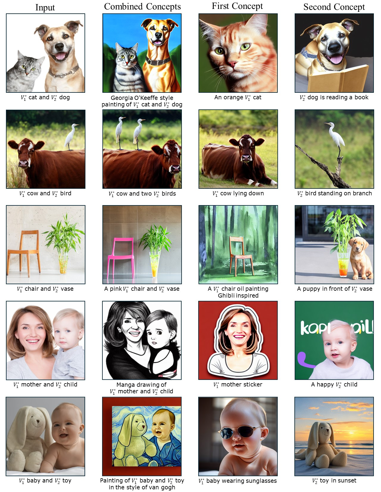

# DisenDiff
## Attention Calibration for Disentangled Text-to-Image Personalization
<div>
<p align="center">

</p>
</div>

## Datasets
The training images are located in `datasets/images`, the test prompts are located in `datasets/prompts`, and the processed images for evaluating image-alignment can be found in `datasets/data_eval`.

## Key module
The crucial constraints for optimization are implemented in the function `p_losses` within `src/model.py`.

## Results
<div>
<p align="center">

</p>
</div>

## Getting Started
```
conda env create -f environment.yml
conda activate ldm
git clone https://github.com/CompVis/stable-diffusion.git
```

## Fine-tuning
```
## run training
bash run.sh

## sample and evaluate
bash eval.sh
```
The `run.sh` and `eval.sh` scripts include several hyperparameters such as `classes` in the input image,`data_path`, `save_path`, training `caption`, random `seed`, and more. Please modify these executable files to suit your specific requirements.
