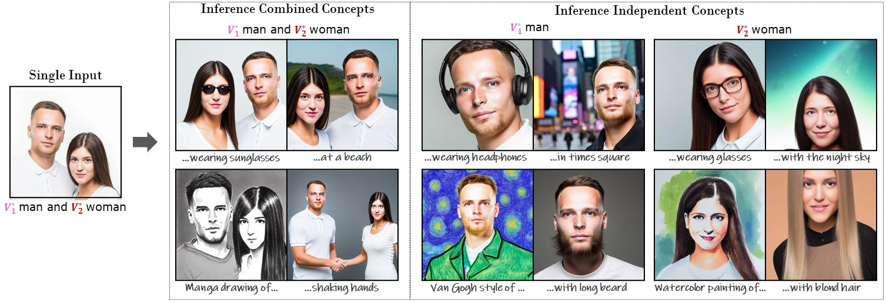

# DisenDiff
## Attention Calibration for Disentangled Text-to-Image Personalization

## Datasets
The training images are located in `datasets/images`, the test prompts are located in `datasets/prompts`, and the processed images for evaluating image-alignment can be found in `datasets/data_eval`.

## Key module
The crucial constraints for optimization are implemented in the function `p_losses` within `src/model.py`.

## Results
